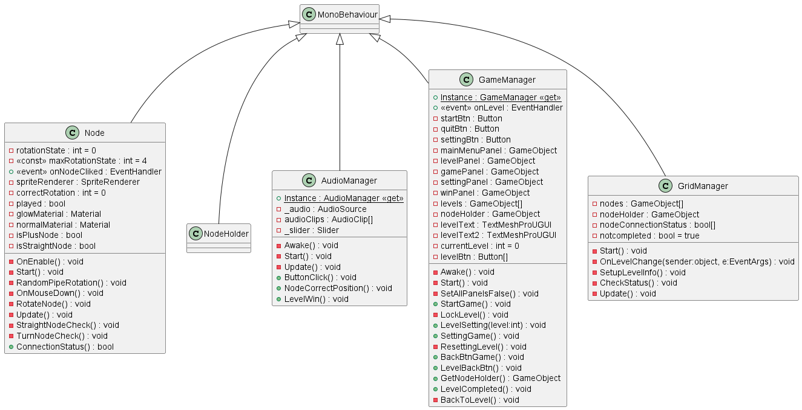

# Requirements
## 1. Game Mechanics
Tap to Rotate Nodes: Players can tap on nodes to rotate them, connecting them on a grid.
Level Completion Feedback: On level completion, lines should illuminate or provide other forms of visual feedback.
## 2. Features
Level Progress and Score Saving: Keep track of player progress and scores across levels.
Levels Menu: Include a menu with locked and unlocked stages.
High Responsiveness: Ensure the game is highly responsive to player inputs.
Enhanced Player Experience: Incorporate particle effects, camera shake, etc., to enhance the player's experience.
Android Preparedness: Ensure the game is prepared for Android deployment.
## 3. Presentation
Asset and Audio Quality: While high asset and audio quality aren't the primary focus, their effective incorporation will be assessed.
## 4. Coding & Documentation
Readable Code: Write succinct and readable code.
Moderate Internal Documentation: Provide moderate internal documentation following the given convention.
## 5. Organization
Logical Folder Structure: Maintain a logical folder structure.
Unity Canvas Usage: Use Unity Canvas for stable Game UI across portrait screen formats.
## 6. Version Control
Regular Commits: Commit to a repository regularly.
Clear Commit History: Maintain a logical and clear commit history.

# Usage
Tap on nodes to rotate and connect them.
Complete levels by illuminating all lines.
Track progress and scores through the levels menu.
Enjoy enhanced visual and responsive feedback.

### ScreenShoot 

### Class Diagram 
